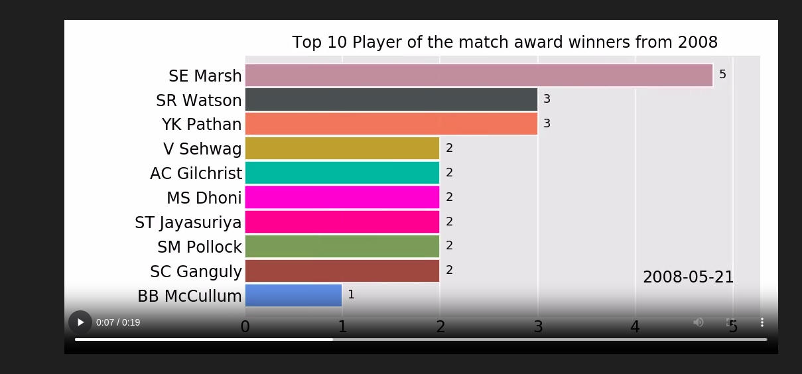

# IPL Data Exploratory Data Analysis (EDA)

Welcome to the repository for the IPL Data Exploratory Data Analysis (EDA) project. This project involves a detailed analysis of the Indian Premier League (IPL) data to uncover insights and patterns using various data visualization and analysis techniques.

## Bar Chart Race
I have used the `bar chart race`  library to create a chart race between various features of the data.

## Data

The dataset used in this project is present in the `./data` folder and has been downloaded from [Kaggle.com](https://www.kaggle.com). The dataset contains information about matches, teams, players, scores, and more.

## Libraries Used

The following Python libraries are used in this project:

- `pandas`
- `pandas_profiling`
- `bar_chart_race`

You can install these libraries using pip:

```bash
pip install pandas pandas_profiling
```

## Usage
To explore the IPL data, you can open the `eda.ipynb` Notebook provided in the repository. 